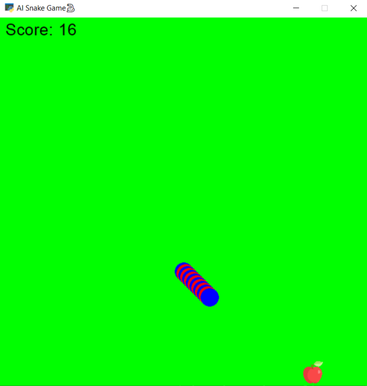

# MohammadAli Mirzaei
---
## files description

| File name | Description |
|--- | --- |
|main.py | A simple snake game |
|main_ai.py | A snake game which is use an AI power |

By eating each of the objects in the window(in simple snake game), the length of the snake's body will increase and the player's score will change as follows:
1. Pear: 2 points
2. Apple: 1 point
3. Shit: -1 point

Game over modes:
1. Snake get out of the window
2. The player's score becomes zero

