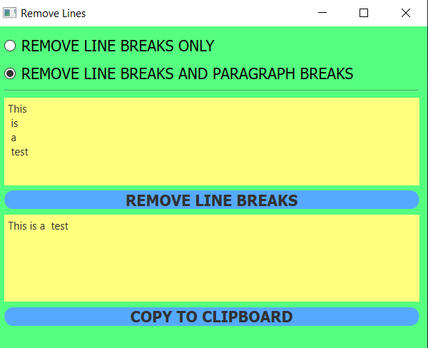

# MohammadAli  Mirzaei

# How to use

### There are two kinds of breaking

- Rremove Line Breaks
- Rremove Line Breaks And Paragraph Breaks

### Whenever you choose one of them, you should just click the "REMOVE LINE BREAK" button and if you wanted to copy the new text, you could just click the "COPY TO CLIPBOARD" botton

​