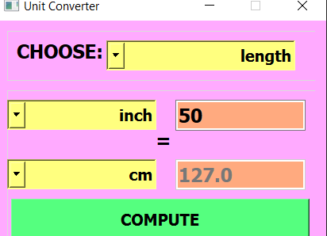

# MohammadAli  Mirzaei

# How to use

### There are four kinds of units

- Weight
- Length
- Temperature
- Digital Volume

### Whenever you choose one of them, you should just click the "COMPUTE" button and then you will get the result

​