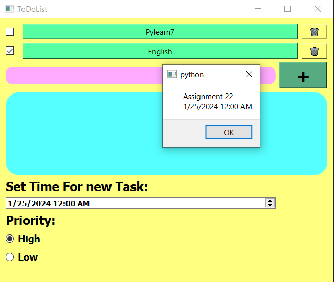

# Todo list
The main purpose of this application is to provide yourself with a list of your priorities in order to ensure that you don't forget anything and are able to effectively plan out your tasks so that they are all accomplished in the correct time frame.



You can add a task which includes time, priority and discription.

Run the app:
```
python main.py
```