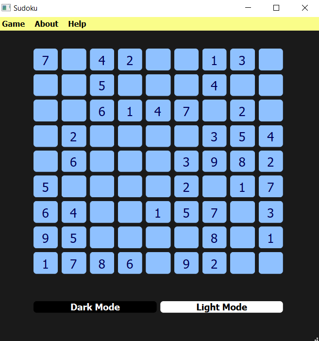

# Sudoku Game 

## Description

This program is a simple Sudoku game with a graphical user interface, built using PySide6 and Python.

## Screenshot

## Features

- Create new game
- Auto-solve Sudoku
- Load game from text file
- Dark mode
- User input validation
- Win message

## Run

`
python main.py
`